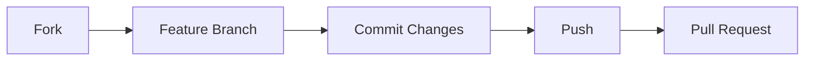

<div align="center">

# 🗳️ VotersChain

### Secure • Decentralized • Transparent

*A next-generation voting system powered by blockchain technology*

---

[](https://github.com/yourusername/VotersChain)
[](https://opensource.org/licenses/MIT)
[](https://hardhat.org/)

</div>

## Demo
[Demo of the project](https://youtu.be/dLyB_THV5nE)

## ✨ Overview

VotersChain revolutionizes traditional voting systems by combining blockchain security with user-friendly interfaces. Our platform ensures transparent, tamper-proof elections while maintaining voter privacy and system integrity.

---

## 🎯 Core Features

<div align="center">
<table>
<tr>
<td width="50%">

### 🔐 Security & Authentication
- Role-based JWT authentication
- Protection against common attacks:
  - NoSQL injection
  - CORS vulnerabilities
  - XSS attacks
- Military-grade input validation
- Secure session management

</td>
<td width="50%">

### 👤 Admin Controls
- Comprehensive voter management
- Election creation & oversight
- Secure credential distribution
- Ethereum wallet provisioning
- Real-time monitoring dashboard

</td>
</tr>

<tr>
<td width="50%">

### 🗽 Voter Experience
- Intuitive election interface
- MetaMask wallet integration
- One-vote guarantee
- Real-time results
- Complete privacy protection

</td>
<td width="50%">

### ⛓️ Blockchain Power
- Smart contract automation
- Immutable vote records
- Transaction verification
- Transparent audit trail
- Decentralized security

</td>
</tr>
</table>
</div>

---

## 🛠️ Technology Stack

<div align="center">

### Frontend


### Backend


### Blockchain


</div>

---

## 🚀 Installation & Setup

### Prerequisites

```markdown
✅ Node.js
✅ MongoDB
✅ MetaMask
✅ Git
```

### 🔗 Blockchain Setup

```bash
# Terminal 1: Fire up the local blockchain
cd client
npx hardhat node

# Terminal 2: Deploy your contracts
cd client
npx hardhat compile
npx hardhat run scripts/deploy.js --network localhost
```

Create `.env` in client directory:
```env
VITE_CONTRACT_ADDRESS=<your_deployed_contract_address>
```

### 🖥️ Backend Configuration

```bash
# Terminal 3: Set up your server
cd server
npm install
```

Create `.env` in server directory:
```env
PORT=<port_number>
MONGO_URI=<mongodb_connection_string>
JWT_SECRET=<your_jwt_secret>
ADMIN_EMAIL=<admin_email>
ADMIN_PASSWORD=<admin_password>
EMAIL_ID=<your_gmail_address>
EMAIL_PASS=<google_app_password>
```

Launch the server:
```bash
nodemon server.js
```

### 🎨 Frontend Launch

```bash
# Terminal 4: Fire up the frontend
cd client
npm install
npm run dev
```

### 🦊 MetaMask Configuration

1. 📥 Install MetaMask extension
2. 🔓 Launch MetaMask
3. ⚡ Select "Import Account"
4. 🔑 Enter your private key
5. 🌐 Connect to local network

---

## 📊 System Architecture

Our system is built on a robust database schema with the following core components:

<div align="center">
<table>
<tr>
<td width="33%">

### 🔷 User Management
- Device tracking
- Voter profiles
- Authentication records
- Access controls

</td>
<td width="33%">

### 🔷 Election System
- Campaign details
- Candidate profiles
- Voting records
- Result tabulation

</td>
<td width="33%">

### 🔷 Security Layer
- Audit trails
- Transaction logs
- Device fingerprints
- Security metrics

</td>
</tr>
</table>
</div>

---

## 🛡️ Security Features

### 🔒 Authentication
- JWT session management
- Role-based access
- Secure credential handling

### 🔐 Protection
- NoSQL injection guards
- CORS security
- XSS prevention
- Input sanitization

### ⛓️ Blockchain
- Smart contract verification
- Transaction validation
- Immutable records

### 📱 Device Security
- Fingerprinting
- Browser monitoring
- OS tracking

---

## 🤝 Contributing



1. 🍴 Fork the repository
2. 🌿 Create feature branch (`git checkout -b feature/amazing-feature`)
3. 💾 Commit changes (`git commit -m 'Add amazing feature'`)
4. ⤴️ Push to branch (`git push origin feature/amazing-feature`)
5. 🎯 Open Pull Request

<div>

Made with ❤️ by ChainSecure Solutions

</div>
